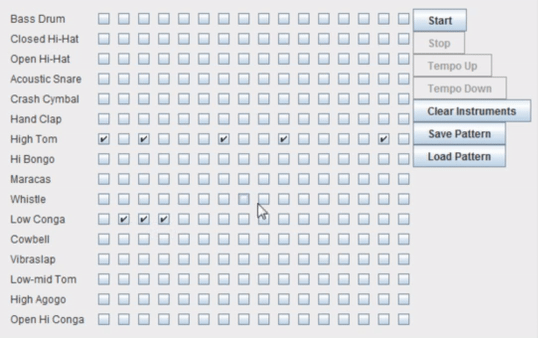

# Beat-Box

My redesign of the Beat Box guided project from "Java Head First" to fit MVC architecture, with help from the Observer pattern.  My redesign also adds enabling and disabling functionality to the GUI widgets when appropriate.

What is the MVC?   MVC stands for Model-View-Controller, a form of design architecture that is used commonly for desktop applications, Generated User Interfaces, and web development.  In MVC, Model represents the data the application holds, the logic that serves the important purpose that the program was designed for.  View is what the user sees.  In this case, it is the GUI that displays the instrument list, checkboxes for choosing instrument beats and buttons which the user can select to alter behavior.  Lastly, the controller acts as the middleman between the model and view.  

Rather than the model reacting directly to user interaction through the view, user actions are passed first to the controller, which then decides what actions are appropriate to place to the model, and vice-versa.  Seperating responsibility in this way, and having a buffer class between view and model, the classes which are doing the real work in this project, will allow greater flexibility in future updates and additions of features while allowing greater code reuse.

